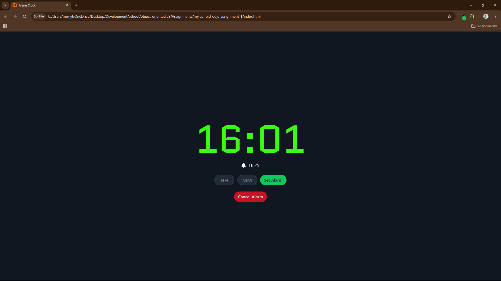

# System Status
Simple alarm clock. Displays and updated the time in real time, dependant on your
system and location. I tried to go for a 'retro' alarm clock vibe, but was unable 
to find and figure out how to put a good analogue font for the clock, so I found 
one that was close enough to what I was looking for
---

## Features

Basic Alarm functions - set and remove.

---

## Lessons Learned

Found myself struggling a little with this one. My logic ended up really getting
put to the test to make sure that everything was functioning the way that I wanted
it to. The most difficult part was actually just getting the audio clip to play
at the right time, and only once. Once I figured out that I basically needed a second
variable of the time to compare to, it was easy from there. 

Another challenge that I had was getting the red borders to show up again after already
putting in an alarm. After some searching around I managed to figure out what the 
issue was and got it working.

---

## Screenshots

---

  
  
   

